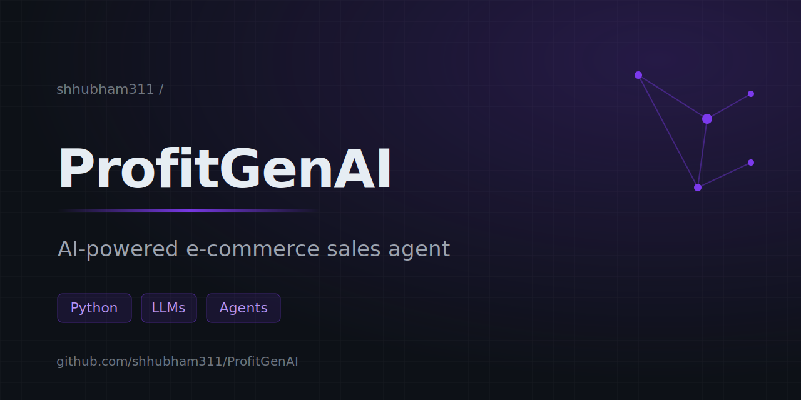
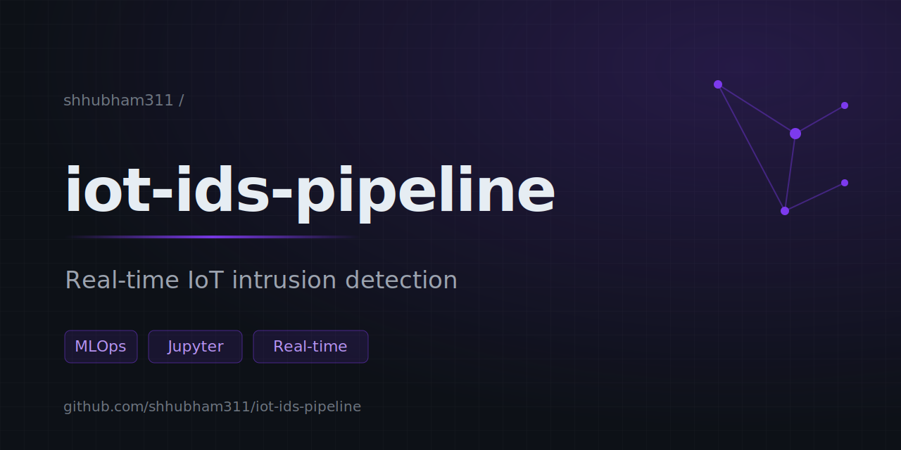
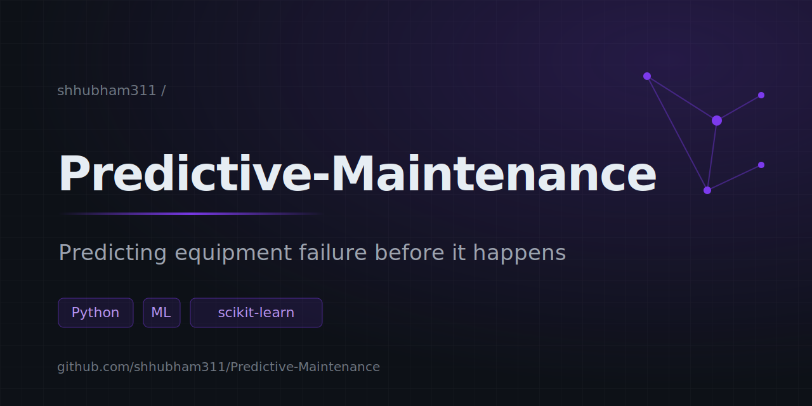
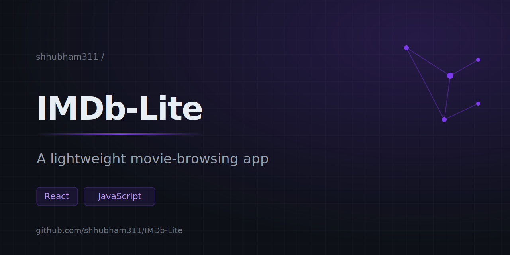
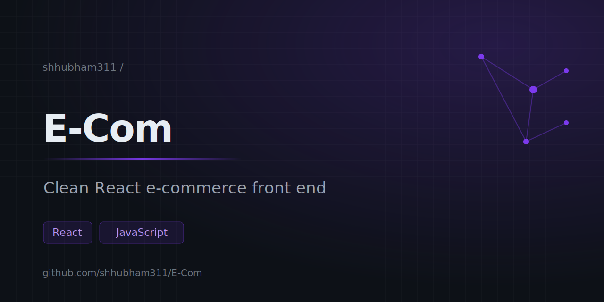
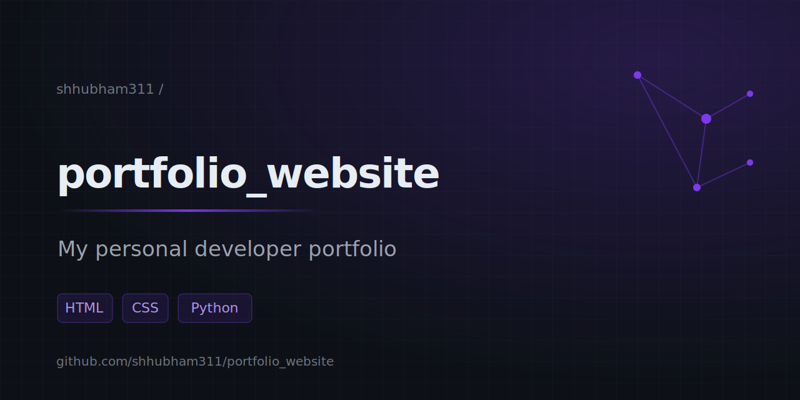

<!--
  Profile README · shhubham311
  Repo must be named exactly: shhubham311   |   File: README.md
  Banner lives at assets/banner.svg · Metrics generated to assets/metrics.svg
  Accent color throughout: #7C3AED
-->

<div align="center">
  
</div>

&nbsp;

I build where machine learning meets the real world. The part I care about isn't the model — it's the unglamorous 90% around it: the data plumbing, the retraining, and whatever keeps a thing alive in production once the demo is over.

<picture><source media="(prefers-color-scheme: dark)" srcset="https://img.shields.io/badge/-currently-7C3AED?style=flat-square&labelColor=161b22"/></picture>
&nbsp; learning real **ML/AI** &nbsp;·&nbsp; open to **collaborations**

---

### Everything I've built

<table>
<tr>
<td width="50%" valign="top">

<a href="https://github.com/shhubham311/ProfitGenAI"></a>

#### [ProfitGenAI](https://github.com/shhubham311/ProfitGenAI)
An AI agent that handles e-commerce sales conversations end to end — a lesson in how much an "AI product" is plumbing and prompt discipline rather than the model. &nbsp;<kbd>Python</kbd> <kbd>LLMs</kbd>

</td>
<td width="50%" valign="top">

<a href="https://github.com/shhubham311/iot-ids-pipeline"></a>

#### [iot-ids-pipeline](https://github.com/shhubham311/iot-ids-pipeline)
An MLOps pipeline that flags network intrusions on IoT devices in real time. Where I learned the model is the easy 10% — the rest is ingestion, retraining, and not breaking in prod. &nbsp;<kbd>MLOps</kbd> <kbd>Jupyter</kbd>

</td>
</tr>
<tr>
<td width="50%" valign="top">

<a href="https://github.com/shhubham311/Predictive-Maintenance"></a>

#### [Predictive-Maintenance](https://github.com/shhubham311/Predictive-Maintenance)
Predicts industrial equipment failure before it happens. Made me treat the precision/recall tradeoff as a business decision, not a metric to max out. &nbsp;<kbd>Python</kbd> <kbd>scikit-learn</kbd>

</td>
<td width="50%" valign="top">

<a href="https://github.com/shhubham311/IMDb-Lite"></a>

#### [IMDb-Lite](https://github.com/shhubham311/IMDb-Lite)
A lightweight IMDb clone for browsing movie details — a React build from when I was nailing down front-end fundamentals. &nbsp;<kbd>React</kbd> <kbd>JavaScript</kbd>

</td>
</tr>
<tr>
<td width="50%" valign="top">

<a href="https://github.com/shhubham311/E-Com"></a>

#### [E-Com](https://github.com/shhubham311/E-Com)
A React e-commerce front end. Still proud of how clean the cart logic turned out. &nbsp;<kbd>React</kbd> <kbd>JavaScript</kbd>

</td>
<td width="50%" valign="top">

<a href="https://github.com/shhubham311/portfolio_website"></a>

#### [portfolio_website](https://github.com/shhubham311/portfolio_website)
My personal portfolio — the hand-built version of who I am as a developer. &nbsp;<kbd>HTML</kbd> <kbd>CSS</kbd> <kbd>Python</kbd>

</td>
</tr>
</table>

<sub><a href="https://github.com/shhubham311?tab=repositories">→ See all repositories</a></sub>

---

### By the numbers

<div align="center">
  
</div>

---

### Recently shipped
<!--START_SECTION:activity-->
<!-- This list is generated automatically by the Recent activity workflow. -->
<!--END_SECTION:activity-->

---

### Where my coding time goes
<!--START_SECTION:waka-->


**I'm a Night 🦉** 

```text
🌞 Morning                1 commits           ░░░░░░░░░░░░░░░░░░░░░░░░░   00.87 % 
🌆 Daytime                47 commits          ██████████░░░░░░░░░░░░░░░   40.87 % 
🌃 Evening                67 commits          ███████████████░░░░░░░░░░   58.26 % 
🌙 Night                  0 commits           ░░░░░░░░░░░░░░░░░░░░░░░░░   00.00 % 
```
📅 **I'm Most Productive on Saturday** 

```text
Monday                   1 commits           ░░░░░░░░░░░░░░░░░░░░░░░░░   00.87 % 
Tuesday                  23 commits          █████░░░░░░░░░░░░░░░░░░░░   20.00 % 
Wednesday                3 commits           █░░░░░░░░░░░░░░░░░░░░░░░░   02.61 % 
Thursday                 0 commits           ░░░░░░░░░░░░░░░░░░░░░░░░░   00.00 % 
Friday                   28 commits          ██████░░░░░░░░░░░░░░░░░░░   24.35 % 
Saturday                 46 commits          ██████████░░░░░░░░░░░░░░░   40.00 % 
Sunday                   14 commits          ███░░░░░░░░░░░░░░░░░░░░░░   12.17 % 
```


📊 **This Week I Spent My Time On** 

```text
💬 Programming Languages: 
HTML                     44 mins             █████████████░░░░░░░░░░░░   53.59 % 
CSS                      20 mins             ██████░░░░░░░░░░░░░░░░░░░   24.41 % 
JavaScript               15 mins             █████░░░░░░░░░░░░░░░░░░░░   18.27 % 
Image (svg)              2 mins              █░░░░░░░░░░░░░░░░░░░░░░░░   02.90 % 
Markdown                 0 secs              ░░░░░░░░░░░░░░░░░░░░░░░░░   00.84 % 

🔥 Editors: 
VS Code                  1 hr 23 mins        █████████████████████████   100.00 % 

🐱‍💻 Projects: 
Gate Tracker             1 hr 23 mins        █████████████████████████   100.00 % 
```

**I Mostly Code in HTML** 

```text
HTML                     3 repos             ██████░░░░░░░░░░░░░░░░░░░   25.00 % 
JavaScript               3 repos             ██████░░░░░░░░░░░░░░░░░░░   25.00 % 
TypeScript               2 repos             ████░░░░░░░░░░░░░░░░░░░░░   16.67 % 
Python                   2 repos             ████░░░░░░░░░░░░░░░░░░░░░   16.67 % 
Jupyter Notebook         2 repos             ████░░░░░░░░░░░░░░░░░░░░░   16.67 % 
```


 Last Updated on 11/07/2026 19:42:51 UTC
<!--END_SECTION:waka-->

---

<p>
<a href="https://shubham311-portfolio.vercel.app/"><b>Portfolio</b></a> &nbsp;·&nbsp;
<a href="https://www.linkedin.com/in/shubhamkumar311/"><b>LinkedIn</b></a>
</p>

<sub>Still learning, still experimenting. Always up to talk shop.</sub>
